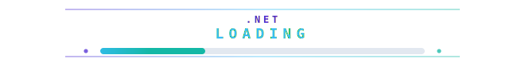

<div align="center">


<br>


<br>



</div>

---

## About


I build practical software around automation, backend systems, AI-assisted workflows and developer productivity.

My strongest area is turning messy workflows into tools that can be tested, repeated and improved: scripts, CLIs, browser automation, APIs, RAG assistants, admin panels and internal utilities.

I like understanding systems from the inside: logs, processes, data flow, failure modes, integrations and the small details that make software reliable in real use.

```bash
christian@github:~$ ./status.sh

focus="automation + AI + backend + tooling"
mindset="build real things, study failures, improve the system"
current_mode="learning deeply and shipping cleaner"
```

## Core Focus

| Area | What I build |
| --- | --- |
| Automation | Python scripts, Selenium workflows, Shell tools, AutoHotkey shortcuts and repeatable local processes |
| AI / RAG | Local assistants, semantic search, embeddings, FAISS pipelines and knowledge-base retrieval |
| Backend | Java, Spring Boot, APIs, authentication, business logic and database-driven services |
| Frontend | Angular, Vue 3 and JavaScript interfaces for practical internal tools |
| Fullstack | Laravel/PHP applications, admin panels, ERP-style workflows and API-backed systems |
| Tooling | CLI launchers, terminal workflows, debugging utilities and productivity systems |

## Tech Stack

<div align="center">
  
</div>

## Featured Public Projects

<table>
  <tr>
    <td width="50%">
      <h3>whatsapp-terminal</h3>
      <p>Terminal-based WhatsApp Web client built with Python and Selenium.</p>
      <p><strong>Focus:</strong> browser automation, Selenium sessions, DOM parsing, terminal interaction and CLI workflow experiments.</p>
      <p><strong>Stack:</strong> Python, Selenium, CLI, Browser Automation</p>
      <a href="https://github.com/christian-racsic/whatsapp-terminal">View repository</a>
    </td>
    <td width="50%">
      <h3>CcsRagAssist</h3>
      <p>Local RAG assistant for technical support using semantic search.</p>
      <p><strong>Focus:</strong> embeddings, FAISS vector search, semantic retrieval, JSON knowledge bases and optional local validation.</p>
      <p><strong>Stack:</strong> Python, FAISS, Sentence Transformers, Ollama, RAG</p>
      <a href="https://github.com/christian-racsic/CcsRagAssist">View repository</a>
    </td>
  </tr>
  <tr>
    <td width="50%">
      <h3>windows-ahk-shortcuts</h3>
      <p>Windows productivity automation using AutoHotkey.</p>
      <p><strong>Focus:</strong> desktop shortcuts, window management, keyboard-first workflows and daily productivity automation.</p>
      <p><strong>Stack:</strong> AutoHotkey, Windows, Productivity</p>
      <a href="https://github.com/christian-racsic/windows-ahk-shortcuts">View repository</a>
    </td>
    <td width="50%">
      <h3>CiscarERP / Inventory System</h3>
      <p>ERP-style inventory management system developed as a fullstack academic project.</p>
      <p><strong>Focus:</strong> admin panel, backend API, inventory logic, database workflows and business rules.</p>
      <p><strong>Stack:</strong> PHP, Laravel, JavaScript, SQL, Web</p>
      <a href="https://github.com/christian-racsic/admin_inventory">Admin repository</a>
      |
      <a href="https://github.com/christian-racsic/api_inventory">API repository</a>
    </td>
  </tr>
</table>

## Private And Lab Work

Some projects are private because they are used for learning, controlled testing, internal workflows or research.

| Project | Direction |
| --- | --- |
| SharpFrame | Sports-data research engine focused on market movement analysis, calibration and risk-aware analytics |
| CcsLabDeck | Personal command-line launcher for project orchestration and local development workflows |
| Browser Automation Experiments | Selenium reliability, session persistence, DOM analysis and CLI-driven browser control |
| Systems Lab Tools | Client/server fundamentals, file-transfer workflows and controlled networking experiments |

## Engineering Approach

```text
Input / CLI / Frontend
        |
        v
Validation and business rules
        |
        v
Services / automation / AI pipeline
        |
        v
Data layer and integrations
        |
        v
Logs, output, result or action
```

1. Build a working version.
2. Test it in real scenarios.
3. Read logs and understand failures.
4. Refactor the structure.
5. Improve reliability.
6. Document what matters.
7. Keep learning.

## Currently Improving

| Now | Next |
| --- | --- |
| Advanced Python automation | Local AI agents |
| AI assistants and RAG systems | Vector databases |
| Spring Boot backend systems | Testing and CI/CD |
| Angular and Vue 3 applications | Observability |
| Laravel fullstack applications | Cloud deployment |
| Shell-based developer tooling | System design |

## GitHub Analytics

<div align="center">
  
  
</div>

<br>

<div align="center">
  
</div>

## Current Mode

```bash
christian@lab:~$ ./build.sh

[OK] Focus mode enabled
[OK] Projects loading
[OK] Curiosity online
[OK] Practical learning active
[OK] Documentation improving
[OK] Real software in progress

status: building
```

## Philosophy

I believe the best way to learn is to build something real, observe where it breaks, understand why, and make the next version better.

> Automation teaches precision. Debugging teaches patience. Backend teaches structure. AI teaches abstraction. Logs teach reality.

<div align="center">
  <strong>Building. Learning. Investigating. Improving.</strong>
  <br>
  
</div>
